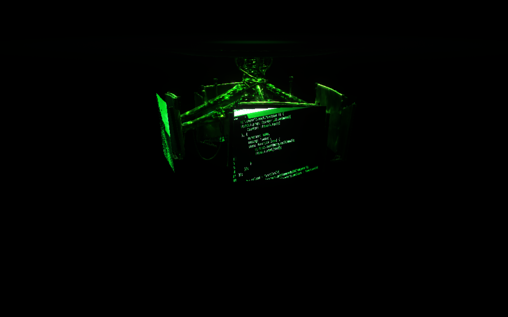

# Cyphernaut — hero section

A fullscreen hero: a Three.js scene of a futuristic energy machine hung from a
ceiling mount, four video screens seated in its monitor frames, a 4-second
camera dolly that blends into a continuous idle orbit, and a three-pass post
chain — all on a strict one-accent green palette. No overlay chrome: the page
is a bare 3D canvas.



## Run

```bash
python qa/serve.py 8123
```

Then open <http://127.0.0.1:8123/>. No build step, no dependencies — Three.js
0.158 loads over an import map.

## What's here

| Path | |
|---|---|
| `index.html` | markup, import map, and the `HERO_ASSETS` config block |
| `css/hero.css` | the stage and preloader, on a 1024px design canvas |
| `js/hero.js` | scene, lights, environment, screens, intro, post chain |
| `js/chrome.js` | design-canvas scaling — all it does now |
| `assets-final/hero-rig.glb` | the optimised machine (150k tris, 2.37 MB) |
| `source/` | the raw 57 MB Tripo export — **git-ignored**, never shipped |
| `placeholders/` | procedural screen loops + the ffmpeg script that makes them |
| `qa/` | screenshot driver, dev server, and the two asset-pipeline steps |
| `HERO_SPEC.md` | the build spec |
| `DECISIONS.md` | **every judgement call, and why** |

## How it works

**1024px design canvas.** Everything is authored at 1024px wide and scaled by
`viewportWidth / 1024` — `zoom` on Chromium/Firefox desktop, `transform: scale()`
on Safari and touch, because WebKit desyncs `zoom` from `getBoundingClientRect`
once the page scrolls. Coarse-pointer devices get the viewport meta rewritten to
`width=1024`.

**One body, one axis.** The model and all four screens live under `rigBody`,
which lives under `rig`. The model's bounding-box top is placed exactly at
`CEILING_Y` so it hangs from the mount with no gap. Scroll drives exactly one
value — `rig.rotation.y`. There is no scroll lift, no tilt, no mouse parallax.

**One accent hue.** Black stage, green as the only emotional colour. A single
`GREEN_RAMP` (black → `#02160b` → `#0a3d1f` → `#148f43` → `#19e65a` → `#8affb0`
→ `#eafff2`) grades the screen footage, so arbitrary stock clips never drop a
foreign hue into the viewport.

**A procedural environment.** The rig's material is metalness 0.88 / roughness
0.07 — a near-mirror, which renders as a black silhouette with nothing to
reflect. `hero.js` builds an environment map at runtime from the palette tokens
(a gradient shell plus a key card) through `PMREMGenerator`. No asset, no extra
dependency. `ENV_INTENSITY` is the exposure knob for the machine.

**Post chain**, in order: `RenderPass → UnrealBloomPass → FilmPass`. Bloom is
deliberately restrained (strength 0.30, radius 0.20, threshold 0.70) so the
geometry reads as geometry; `FILM_STRENGTH` is a whisper of grain with
scanlines off. DPR is hard-capped at 1.0 — the canvas backing store stays
1024×629 at every viewport.

## Assets

The rig is required; a missing GLB is a loud `console.error`, not a silent
fallback. Screens still hot-swap:

| Drop in | Replaces |
|---|---|
| `hero-rig.glb` | — required, no fallback |
| `screen-a..d.mp4` | free Pexels stock, then local procedural loops offline |

Screens resolve **stock URL → local loop**, so a blocked CDN or no network at
all still renders. Set `HERO_ASSETS.finalScreens` to `true` once real finals are
dropped in `assets-final/` — until then the loader skips that step rather than
404ing four times. Stock footage is graded onto the palette tiers; set
`HERO_ASSETS.screenGrade` to `0` for raw footage colour.

### Rebuilding the rig from source

The raw Tripo export is 57.4 MB / 1.87 M triangles with three 4096² textures —
268 MB of VRAM. Two steps, deliberately two processes:

```bash
node qa/step1-textures.mjs source/futuristic-energy-machine.glb /tmp/tex.glb 2048 2048 1024
node qa/step2-geometry.mjs /tmp/tex.glb assets-final/hero-rig.glb 0.08 0.01
```

They are separate because importing `@gltf-transform/functions` poisons `sharp`
in the same process (see DECISIONS.md).

## Dev tools

`?tune=1` exposes `__screens`, `__rig`, `__rigBody`, `__cam`, `__controls` and
`__film`, and binds a keyboard nudger: `1`–`4` select a screen, arrows
translate, shift+arrows rotate, `[`/`]` scale, `P` logs a paste-ready
`.set(...)` line. Nothing binds when the flag is absent.

`qa/shoot.mjs` drives headless Chrome over CDP and waits real wall-clock time
(`--virtual-time-budget` doesn't advance `performance.now()`, which the intro is
clocked on, so it would capture frame zero):

```bash
node qa/shoot.mjs http://127.0.0.1:8123/ qa/hero-1440.png 1440 900 9000
```

Flags: `--eval "<js>"` to interact before the shot, `--print` to dump the eval
result, `--after <ms>`, `--scrollbars`, and `-` as the output path for a
probe-only run.
